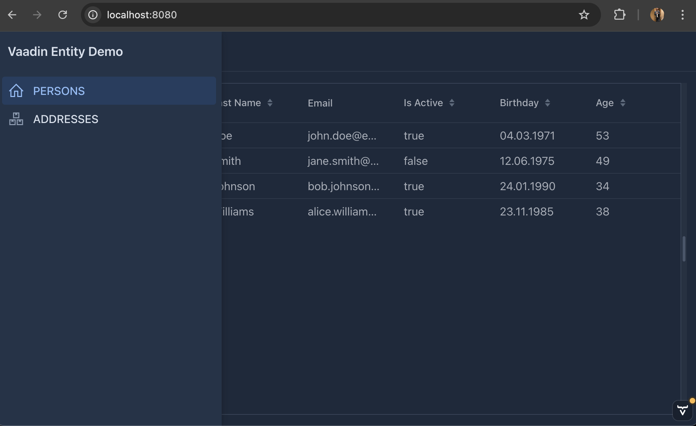
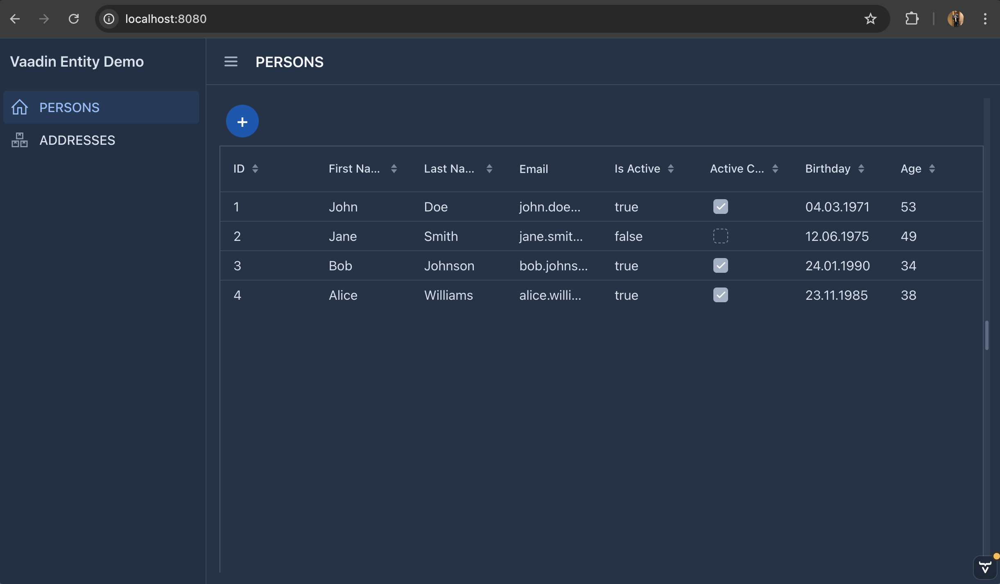
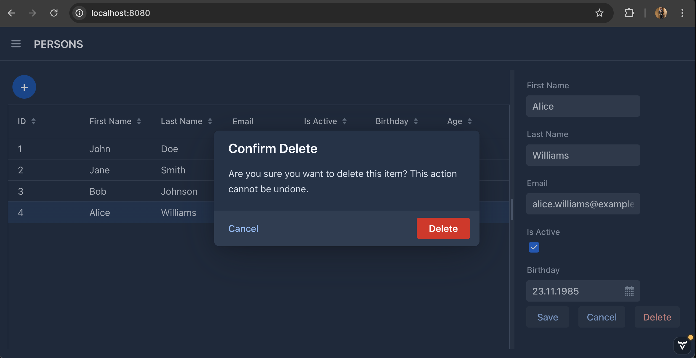
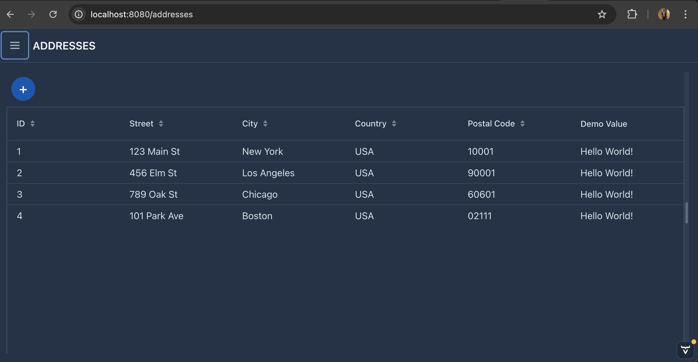

# Vaadin Dynamic Entity Grid/Form Generation
This demo shows how you can extend your data entities to auto-generate Grids and Forms.

Based on:
- Spring Boot 3.4.1
- Vaadin Flow 24.6.2
- JDK21

### NEW
- Added Vaadin Component-Column example to GenericGrid for Boolean values of entity properties und methods.
- Added Spring Boot Starter Validation to enable Form validation.

## Annotations

### Custom Annotation: GridColumn
Use this annotation to let the GenericView auto-render your Grid. Use the annotaion properties to configure the 
behavior of each column. 

```JAVA
@Retention(RetentionPolicy.RUNTIME)
@Target({ElementType.FIELD, ElementType.METHOD})
public @interface GridColumn {
   String header() default "";
   int order() default 999;
   boolean sortable() default true;
   String dateTimeFormat() default "";
   boolean showAsComponent() default false;
}
```

### Custom Annotation: FormField
Use this annotation to define, which Entity.Property will show up to edit and how it behaves.

```JAVA
@Retention(RetentionPolicy.RUNTIME)
@Target(ElementType.FIELD)
public @interface FormField {
    String label() default "";
    int order() default 999;
    boolean required() default false;
}
```

### Entites
This demo provides two entity types:
- Person
- Address

#### Example

```JAVA
@@Data
@AllArgsConstructor
@NoArgsConstructor
public class Person implements BaseEntity {
   @GridColumn(header = "ID", order = 0)
   private Long personId;

   @NotBlank(message = "First name is required")
   @Size(min = 2, max = 50, message = "First name must be between 2 and 50 characters")
   @GridColumn(header = "First Name", order = 1)
   @FormField(label = "First Name", required = true, order = 1)
   private String firstName;

   @NotBlank(message = "Last name is required")
   @Size(min = 2, max = 50, message = "Last name must be between 2 and 50 characters")
   @GridColumn(header = "Last Name", order = 2)
   @FormField(label = "Last Name", required = true, order = 2)
   private String lastName;

   @NotBlank(message = "Email is required")
   @GridColumn(header = "Email", order = 3, sortable = false)
   @FormField(label = "Email", required = true, order = 3)
   private String email;

   @GridColumn(header = "Is Active", order = 4)
   @FormField(label = "Is Active", required = true, order = 4)
   private Boolean isActive;

   @GridColumn(header = "Birthday", order = 6, dateTimeFormat = "dd.MM.yyyy")
   @FormField(label = "Birthday", required = true)
   private LocalDate birthday;

   @GridColumn(header = "Active Component", order = 5, showAsComponent = true)
   public Boolean exampleBoolean(){
      return isActive;  // Just for demonstration purpose Component
   }

   @GridColumn(header = "Age", order = 6)
   public int getAge() {
      if (birthday == null) return 0;
      return Period.between(birthday.atStartOfDay().toLocalDate(), LocalDate.now()).getYears();
   }
}
```

## Demo UI

### Navigation


### Persons View


#### Delete Dialog


### Addresses View


## The Views to extend GenericView<T>
This view demonstrates how to bootstrap components or views using autogenerated Grids and Forms.

### Usage Example
```JAVA
@PageTitle("PERSONS")
@Menu(order = 0, icon = "line-awesome/svg/home-solid.svg")
@Route(value = "", layout = MainLayout.class)
public class PersonView extends GenericView<Person> {

   private final DataService dataService;


   public PersonView(DataService dataService) {
      super(Person.class);
      this.dataService = dataService;
      refreshGrid();
   }

   @Override
   protected void saveEntity(Person entity) {
      dataService.savePerson(entity);
   }

   @Override
   protected List<Person> loadEntities() {
      return dataService.findAllPersons();
   }

   @Override
   protected void deleteEntity(Person person) {
      dataService.deletePerson(person);
   }
}
```

# GenericView - Generic CRUD Implementation for Vaadin

## Overview
The GenericView is a type-safe, annotation-driven generic CRUD (Create, Read, Update, Delete) implementation for Vaadin applications that automatically generates Grid views and edit forms based on entity definitions. It minimizes boilerplate code while maintaining flexibility and extensibility.

## Key Features
- Automatic Grid column generation including ComponentColumns
- Automatic form field generation
- Support for computed/derived properties
- DateTime formatting capabilities
- Type-safe data binding
- Customizable layouts with split view
- Support for validation

## Technical Implementation

### Core Technologies Used
1. **Java Reflection API**
    - Dynamic field and method discovery
    - Runtime annotation processing
    - Dynamic property access and invocation
    - Type introspection for appropriate component selection

2. **Custom Annotations**
    - `@GridColumn`: Configures grid column properties and formatting
    - `@FormField`: Defines form field properties and validation
    - Runtime retention for dynamic processing

3. **Vaadin Components**
    - Grid: Data display
    - FormLayout: Edit form generation
    - Binder: Type-safe data binding
    - SplitLayout: Responsive layout management

4. **Design Patterns**
    - Generic Type Pattern: Type-safe implementation using `<T extends BaseEntity>`
    - Builder Pattern: Component construction
    - Strategy Pattern: Field type handling
    - Observer Pattern: Selection and update handling

## Architecture

### Layer Separation
1. **Presentation Layer**
    - Grid display
    - Form rendering
    - Layout management

2. **Data Binding Layer**
    - Automatic binding setup
    - Type conversion
    - Validation rules

3. **Metadata Layer**
    - Annotation processing
    - Field discovery
    - Configuration management

### Extension Points
- Custom field type handling
- Custom component creation
- Validation rules
- Layout customization
- Formatting options


## Technical Benefits
1. **Reduced Boilerplate**
    - Automatic UI generation
    - Convention over configuration
    - Annotation-based configuration

2. **Type Safety**
    - Compile-time type checking
    - Type-safe data binding
    - Protected against runtime type errors

3. **Maintainability**
    - Centralized CRUD logic
    - Consistent UI behavior
    - Reusable components

4. **Flexibility**
    - Customizable through annotations
    - Extensible for new types
    - Override capabilities

## Best Practices
1. Always implement BaseEntity interface
2. Use meaningful order values in annotations
3. Implement proper validation in save methods
4. Consider caching for computed properties
5. Handle exceptions appropriately

## Performance Considerations
- Reflection usage is minimal and mostly during initialization
- Computed properties are calculated on-demand
- Grid uses lazy loading by default
- Form fields are created only when needed

## Security Notes
- Reflection access is contained within the view
- Field access is controlled through annotations
- Input validation should be implemented in service layer

## Future Enhancement Possibilities
1. Additional annotation features
2. Custom validation rules
3. Advanced filtering capabilities
4. Extended formatting options
5. Custom component integration


